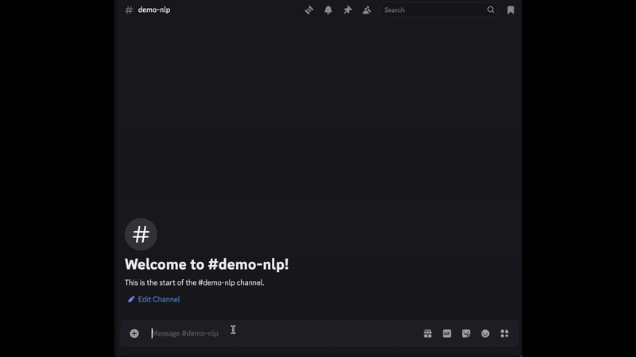

# FestPal Bot

Chatbot cerdas untuk festival musik dengan dukungan CLI dan Discord. Bot ini menyediakan informasi tiket, jadwal artis, lokasi venue, dan customer service untuk Festival FestPal.

## Description

Tugas Project Natural Language Processing 2025
| Nama | NIM |
|--|--|
| Flavia Hidayriamraata Pualam | 22/494376/TK54219 |
| Mahsa Quereda Bahjah | 22/503299/TK/54984 |

## Features

- **Manajemen Tiket**: Harga, kategori, cara beli, refund, dan troubleshooting
- **Lineup & Jadwal**: Informasi artis Day 1-2, guest stars, dan jadwal penampilan
- **Lokasi & Fasilitas**: Info venue, parkir, merchandise, emergency
- **Customer Service**: QR code issues, order tracking
- **Multi-platform**: CLI interactive dan Discord bot integration
- **Natural Language**: Bahasa Indonesia & English dengan reflection mapping
- **Pattern Matching**: Regex-based NLP dengan 40+ response patterns
- **Tested**: 29 comprehensive test cases dengan 100% coverage

## Quick Start

### Prerequisites

- Python 3.8+
- Discord Bot Token (opsional untuk Discord mode)

### Installation

```bash
# Clone repository
git clone https://github.com/queredda/FestPal_nlp.git
cd bot

# Setup virtual environment
python -m venv venv
source venv/bin/activate  # macOS/Linux
# venv\Scripts\activate   # Windows

# Install dependencies
pip install -r requirements.txt
```

## Configuration

```bash
# Copy environment template
cp env.example .env

# Edit .env file - tambahkan Discord bot token
DISCORD_TOKEN=token_di_sini
```

> **Note**: Dapatkan Discord token dari [Discord Developer Portal](https://discord.com/developers/applications)

## Running

### CLI Mode

```bash
python main.py --cli
```

### Discord Bot

```bash
python main.py
```

### Quick Test

```bash
python -c "from bot import ChatBot; bot = ChatBot(); print(bot.reply('halo'))"
```

## Demo

### CLI Demo

```bash
$ python main.py --cli
FestPal Bot CLI - Ketik 'quit' untuk keluar

You: halo
Bot: Halo! Saya FestPal, asisten festival kamu. Mau tanya soal tiket, jadwal, lokasi, atau bantuan lainnya? Ketik 'help' untuk menu lengkap.

You: berapa harga tiket?
Bot: Harga tiket:
- Festival A (Standing): Rp 350.000
- Festival B (Standing): Rp 250.000
- VIP (Seating): Rp 500.000

Beli melalui website resmi atau partner terpercaya!

You: siapa guest star nya?
Bot: Guest stars & lineup:
Day 1:
  • Tulus — 18:00
  • Sabrina Carpenter — 20:00
  • Taylor Swift — 22:00
Day 2:
  • Adele — 17:30
  • Justin Bieber — 19:30
  • Ariana Grande — 21:30

Ketik 'lineup' untuk detail lengkap!

You: refund order ORDER123
Bot: Permintaan refund untuk pesanan ORDER123 telah tercatat. Silakan hubungi support resmi dan sertakan bukti pembayaran serta nomor pesanan tersebut.

You: quit
Bot: Sampai jumpa!
```

### Discord Demo



Bot merespons dengan format yang sama di Discord server.

## Tests

Project memiliki **29 test cases** yang mencakup semua fitur utama:

```bash
# Jalankan tests
pytest tests/ -v
# Output: ========================================== 29 passed in 0.05s ==========================================

```

### Test Coverage

- **Core Bot Functionality**: 25 tests covering greetings, identity, help, tickets
- **Utility Functions**: 4 tests for reflection mapping, lineup formatting, data validation
- **Pattern Matching**: Tests for all regex patterns and response handling
- **Error Handling**: Fallback responses and invalid input handling

## Project Structure

```
bot/
├── main.py              # Entry point (CLI & Discord)
├── bot.py               # Core chatbot logic
├── requirements.txt     # Dependencies
├── env.example         # Environment template
├── .gitignore          # Git ignore rules
├── tests/              # Unit tests (29 test cases)
│   ├── __init__.py
│   └── test_bot.py
├── logs/               # Application logs
│   └── bot.log
└── demo/               # Demo materials
    └── nlp_demo.gif
```

## Bot Capabilities

- **Tiket & Pembayaran**: Harga, kategori, cara beli, metode pembayaran, promo
- **Event & Lineup**: Jadwal lengkap Day 1-2, guest stars, penampil hari ini
- **Lokasi & Fasilitas**: Venue GOR UNY, parkir umum/VIP/motor, transport
- **Customer Service**: Refund, QR/e-ticket issues, contact CS, resale warning
- **Advanced**: Natural language ID/EN, reflection mapping, order tracking

## Technical Implementation

### Regex Pattern Matching

Bot menggunakan 40+ regex patterns untuk mengenali intent pengguna:

- **Greetings & Identity**: Deteksi salam dan pertanyaan identitas
- **Ticket Management**: Harga, kategori, pembelian, refund dengan order tracking
- **Event Information**: Lineup, jadwal, guest stars dengan parsing waktu
- **Location Services**: Venue info, parking details, merchandise
- **Customer Support**: QR issues, e-ticket problems, emergency assistance

### Reflection Mapping

Fitur NLP untuk mengubah perspektif pronoun dalam percakapan:

```python
# Contoh reflection mapping
"saya senang" → "kamu senang"
"punyaku hilang" → "punyamu hilang"
"my ticket" → "your ticket"
```

### Logging & Monitoring

- Comprehensive logging untuk CLI dan Discord modes
- Error handling dan graceful degradation
- Performance monitoring untuk response times

---
